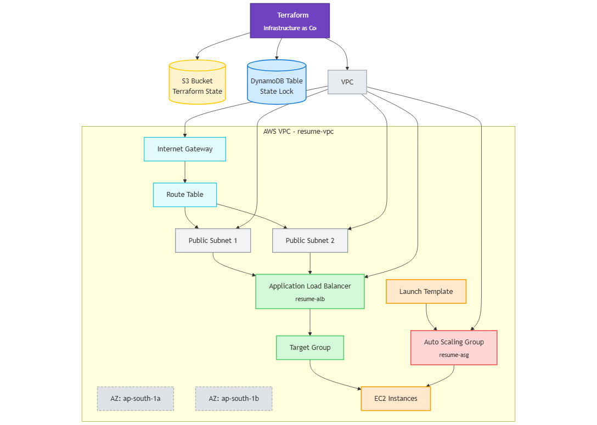

# 🚀 Terraform AWS Infrastructure Project 

This project creates a basic AWS infrastructure using **Terraform**. It's written step-by-step with a clear structure, designed for beginners, and perfect for DevOps learners or resume portfolio projects.

---

## 🧠 What This Project Does

Using Terraform, this project creates:

1. ✅ A **Virtual Private Cloud (VPC)**
2. ✅ Two **public subnets** in different availability zones
3. ✅ An **Internet Gateway** for internet access
4. ✅ A **Route Table** for outbound traffic
5. ✅ A **Launch Template** for EC2 instances
6. ✅ An **Application Load Balancer (ALB)** to distribute traffic
7. ✅ A **Target Group** for ALB health checks
8. ✅ An **Auto Scaling Group (ASG)** to scale EC2s automatically
9. ✅ A **Remote backend** for Terraform using:
   - **S3** (to store the `.tfstate` file)
   - **DynamoDB** (to lock the state file)
---
📁 Project Structure Explained (What Each File/Folder Does)
---
```bash
terraform-project/
├── env/
│   └── dev/
│       ├── backend.tf         <-- Stores remote backend config (S3 + DynamoDB)
│       ├── main.tf            <-- Main file to call modules (vpc, alb_ec2, autoscaling)
│       ├── variables.tf       <-- Input variables like region, instance type, etc.
│       └── terraform.tfvars   <-- Default values for variables (optional override)
│
├── modules/
│   ├── vpc/
│   │   ├── main.tf            <-- Code to create VPC, subnets, route tables, IGW
│   │   └── outputs.tf         <-- Exports subnet IDs to other modules
│   │
│   ├── alb_ec2/
│   │   ├── main.tf            <-- Code for ALB, security groups, launch template
│   │   └── outputs.tf         <-- Exports ALB DNS, launch_template_id, etc.
│   │
│   └── autoscaling/
│       ├── main.tf            <-- Code for Auto Scaling Group
│       └── outputs.tf         <-- Exports ASG name
│
└── README.md                  <-- Main documentation for the project
```

---

## 🗂️ Project Folder Structure

```bash
terraform-project/
├── env/
│   └── dev/
│       ├── backend.tf         # Remote backend config (S3 + DynamoDB)
│       ├── main.tf            # Main entry point to call all modules
│       ├── variables.tf       # Variable definitions (region, instance type, etc.)
│       └── terraform.tfvars   # Default variable values (optional override)
│
├── modules/
│   ├── vpc/
│   │   ├── main.tf            # Code to create VPC, subnets, IGW, route tables
│   │   └── outputs.tf         # Exports public subnet IDs for use by other modules
│   │
│   ├── alb_ec2/
│   │   ├── main.tf            # ALB, Security Groups, Launch Template
│   │   └── outputs.tf         # Exports launch_template_id, target_group_arn, alb_dns_name
│   │
│   └── autoscaling/
│       ├── main.tf            # Auto Scaling Group resource
│       └── outputs.tf         # Exports ASG name
│
└── README.md                  # 📘 This documentation file
```
## 📈 Architecture Diagram


---
⚙️ Requirements
--- 

✅ An AWS account

✅ Terraform installed (https://developer.hashicorp.com/terraform/downloads)

✅ AWS CLI installed and configured

---
🛠️ How to Use This Project
---

1️⃣ Clone the Repo
```bash
git clone https://github.com/Aniruddhakharve/terraform-project.git
cd terraform-project/env/dev
```


2️⃣ Initialize Terraform
```bash
terraform init
```
This will:

Connect to your S3 backend (defined in backend.tf)

Download required modules and providers

3️⃣ Preview the Infrastructure
```bash
terraform plan
```
This shows what Terraform will create, update, or delete.

4️⃣ Deploy Everything
```bash
terraform apply
```
Type yes when prompted. It takes a few minutes.

---
🌐 After Apply – Access Your ALB
---

Once the deployment finishes, Terraform will show:
```bash
alb_dns_name = resume-alb-xxxxx.ap-south-1.elb.amazonaws.com
```
Open that URL in your browser — you should see an EC2 default Amazon Linux page.

🧹 To Clean Up (Avoid AWS Costs)
```bash
terraform destroy
```
This command will remove all resources created by Terraform.

---
💾 About the Remote Backend
---

We manually created the following before running Terraform:

- An S3 bucket to store the Terraform state (.tfstate) file

- A DynamoDB table to lock the state file and prevent concurrent edits

The configuration is saved in backend.tf:
```bash
terraform {
  backend "s3" {
    bucket         = "your-s3-bucket-name"
    key            = "dev/terraform.tfstate"
    region         = "ap-south-1"
    dynamodb_table = "your-lock-table"
  }
}
```
Note
- Replace the bucket and table name with your actual names in the repo.

---
🤔 Why I Made This Project
---

- Learn Terraform basics
- Understand how real cloud setups are built
- Showcase infrastructure-as-code skills on my resume
- Gain hands-on experience with EC2, VPC, ALB, ASG, and remote backends

---
📈 Future Improvements
---

- Add a basic web server (Nginx or Node.js) to EC2
- Add RDS (database layer)
- Add monitoring (CloudWatch alarms)
- Integrate CI/CD pipeline using GitHub Actions

---
👤 Author
---

Aniruddha Kharve

Aspiring DevOps & Cloud Engineer | Terraform + AWS Enthusiast

GitHub: Aniruddhakharve

---
📘 License
---

This project is free to use, clone, and improve for educational and resume purposes.
- Full **beginner-friendly explanations**
- Clean navigation and reuse for future projects


